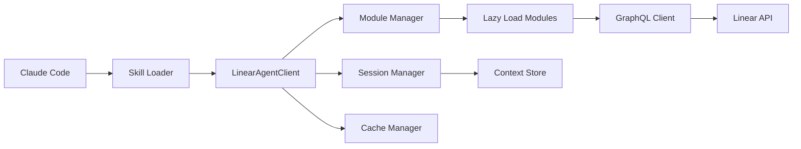

# Product Requirements Document: Linear Toolkit for AI Agents

## Version 1.0
**Date:** November 8, 2025
**Author:** Claude Code Analysis
**Status:** Draft
**Project:** Linear Toolkit - AI Agent Integration Layer

---

## Executive Summary

This document outlines the requirements for a Linear API toolkit specifically designed for AI agents (Claude Code and similar) to programmatically manage software development projects. Unlike traditional CLI tools designed for human interaction, this toolkit will provide a programmatic API optimized for automated workflow management, intelligent issue tracking, and code-aware project coordination.

### Key Objectives
- Enable AI agents to autonomously manage Linear issues based on code changes
- Provide context-aware operations that understand code-to-issue relationships
- Support efficient batch operations for agent workflows
- Design for modular, on-demand tool loading as Claude skills
- Maintain session context for coherent multi-step operations

---

## 1. Current State Analysis

### 1.1 Existing Specification
The current Linear Toolkit exists as a planning document with the following structure:

**Coverage:**
- 8 basic operations (6 for issues, 1 for teams, 1 for projects)
- TypeScript-based implementation
- GraphQL API client
- Environment-based configuration with Zod validation

**Architecture:**
```
linear-toolkit/
├── src/
│   ├── client/        (Linear API client)
│   ├── types/         (TypeScript definitions)
│   ├── scripts/       (CLI entry points)
│   └── utils/         (Configuration)
```

### 1.2 Gap Analysis

| Category | Current State | Required for AI Agents | Gap |
|----------|--------------|----------------------|-----|
| **Coverage** | 8 operations | 40-50 operations | 80% missing |
| **Interface** | CLI scripts | Programmatic API | Complete redesign |
| **Context** | Stateless | Session-based | Not implemented |
| **Integration** | Manual | Automated hooks | Not implemented |
| **Discovery** | Basic list/get | Intelligent search | Not implemented |
| **Updates** | Manual | Code-triggered | Not implemented |

### 1.3 Critical Missing Features for Development Projects

1. **Sprint/Cycle Management** - No ability to manage sprints
2. **Comments & Collaboration** - Cannot add updates to issues
3. **Workflow States** - Cannot track issue progress
4. **Labels & Organization** - No categorization capabilities
5. **Dependencies** - Cannot manage blocking relationships
6. **Search** - No intelligent issue discovery
7. **Bulk Operations** - Inefficient for multiple updates

---

## 2. Product Requirements

### 2.1 User Personas

**Primary: AI Development Agents**
- Claude Code, GitHub Copilot Workspace, and similar
- Need programmatic access to Linear
- Require context preservation across operations
- Must map code changes to project management

**Secondary: Automated Development Tools**
- CI/CD pipelines
- Git hooks
- Test runners
- Security scanners

### 2.2 Core Use Cases

#### UC1: Session Initialization
```typescript
// "What should I work on?"
const session = await linear.initSession();
const context = await session.getWorkContext();
// Returns: assigned issues, current sprint, blocked items
```

#### UC2: Code-Aware Updates
```typescript
// "I modified auth.ts, update relevant issues"
await session.updateFromCodeChanges({
  files: ['src/auth.ts'],
  functions: ['validateToken'],
  tests: { added: 2, passing: true }
});
```

#### UC3: Intelligent Issue Creation
```typescript
// "Found a security issue in the code"
await session.createIssueFromCode({
  type: 'security',
  severity: 'critical',
  file: 'src/api/user.ts',
  line: 45,
  description: 'SQL injection vulnerability'
});
```

#### UC4: Automated State Transitions
```typescript
// "Tests are passing, move to review"
await session.transitionBasedOnCodeState({
  testsPass: true,
  lintPass: true,
  readyForReview: true
});
```

### 2.3 Functional Requirements

#### 2.3.1 Context & Discovery Operations
- **FR1:** Get active work assigned to agent's context
- **FR2:** Find issues related to specific code files/functions
- **FR3:** Search issues by code content or error messages
- **FR4:** Discover blocking dependencies
- **FR5:** Suggest next task based on priority and dependencies

#### 2.3.2 Automated Progress Tracking
- **FR6:** Update issue progress based on code changes
- **FR7:** Auto-transition states based on development status
- **FR8:** Add structured comments with code change summaries
- **FR9:** Link commits and PRs to issues
- **FR10:** Track test results against issues

#### 2.3.3 Intelligent Issue Management
- **FR11:** Create issues from code analysis (TODOs, bugs, security)
- **FR12:** Detect and prevent duplicate issues
- **FR13:** Auto-assign based on code ownership
- **FR14:** Apply labels based on content analysis
- **FR15:** Establish dependencies from code structure

#### 2.3.4 Batch & Efficiency Operations
- **FR16:** Batch update multiple issues in single operation
- **FR17:** Bulk state transitions for related issues
- **FR18:** Efficient pagination for large result sets
- **FR19:** Caching for frequently accessed data
- **FR20:** Rate limit awareness with automatic backoff

### 2.4 Non-Functional Requirements

#### Performance
- **NFR1:** Response time < 500ms for single operations
- **NFR2:** Batch operations support 100+ items
- **NFR3:** Cache hit ratio > 70% for read operations
- **NFR4:** Support concurrent operations

#### Reliability
- **NFR5:** Graceful error handling with recovery suggestions
- **NFR6:** Automatic retry with exponential backoff
- **NFR7:** Session persistence across network failures
- **NFR8:** Idempotent operations where possible

#### Security
- **NFR9:** Secure API key storage and management
- **NFR10:** Audit trail for all modifications
- **NFR11:** Rate limit compliance
- **NFR12:** Input validation and sanitization

#### Developer Experience
- **NFR13:** Comprehensive TypeScript types
- **NFR14:** Structured error responses
- **NFR15:** Minimal configuration required
- **NFR16:** Modular architecture for selective loading

---

## 3. Technical Architecture

### 3.1 System Design

```typescript
// Core Architecture Layers
LinearToolkit/
├── core/                    // Core client and types
│   ├── client/
│   │   ├── LinearAgentClient.ts
│   │   ├── GraphQLClient.ts
│   │   └── SessionManager.ts
│   └── types/
│       └── linear.types.ts
├── modules/                 // Loadable feature modules
│   ├── issues/
│   ├── cycles/
│   ├── comments/
│   ├── labels/
│   └── analytics/
├── integrations/           // External integrations
│   ├── git/
│   ├── github/
│   └── testing/
└── skills/                 // Claude skill configurations
    ├── linear-basic.json
    ├── linear-sprint.json
    └── linear-advanced.json
```

### 3.2 Core Components

#### LinearAgentClient
```typescript
class LinearAgentClient {
  private session: SessionManager;
  private cache: CacheManager;
  private modules: Map<string, Module>;

  // Lazy load modules as needed
  async loadModule(name: string): Promise<Module>

  // Core operations
  async getWorkContext(): Promise<WorkContext>
  async findRelevantIssues(context: CodeContext): Promise<Issue[]>
  async updateFromCodeChanges(changes: CodeChanges): Promise<UpdateResult>
  async createFromAnalysis(analysis: CodeAnalysis): Promise<Issue[]>
}
```

#### Session Manager
```typescript
class SessionManager {
  private context: Map<string, any>;
  private recentOperations: Operation[];
  private activeIssues: Issue[];

  async saveState(): Promise<void>
  async restoreState(sessionId: string): Promise<void>
  async getContext(key: string): Promise<any>
  async setContext(key: string, value: any): Promise<void>
}
```

#### Module System
```typescript
interface Module {
  name: string;
  operations: Map<string, Operation>;
  dependencies?: string[];

  async initialize(client: LinearAgentClient): Promise<void>
  async execute(operation: string, params: any): Promise<any>
}
```

### 3.3 Claude Skill Configuration

```json
{
  "name": "linear-toolkit",
  "version": "1.0.0",
  "description": "Linear project management for coding tasks",
  "modules": {
    "basic": {
      "operations": [
        "getActiveWork",
        "findIssueById",
        "updateIssueProgress",
        "addComment",
        "transitionState"
      ],
      "autoLoad": true
    },
    "sprint": {
      "operations": [
        "getCurrentSprint",
        "addToSprint",
        "getSprintProgress"
      ],
      "autoLoad": false,
      "loadOn": ["sprint", "cycle"]
    },
    "advanced": {
      "operations": [
        "analyzeWorkspace",
        "generateReport",
        "bulkOperations"
      ],
      "autoLoad": false,
      "requiresAuth": "admin"
    }
  },
  "config": {
    "cacheEnabled": true,
    "cacheTTL": 300,
    "batchSize": 50,
    "autoTransition": true,
    "verbosity": "normal"
  }
}
```

### 3.4 Data Flow



---

## 4. Implementation Roadmap

### Phase 1: Core Foundation (Week 1-2)
**Goal:** Basic working toolkit for essential operations

```typescript
// Deliverables
1. LinearAgentClient core class
2. Basic session management
3. Essential operations (10):
   - getActiveWork()
   - findIssueById()
   - findRelevantIssues()
   - updateIssueProgress()
   - addComment()
   - transitionState()
   - createIssue()
   - searchIssues()
   - getCurrentSprint()
   - linkIssues()
```

### Phase 2: Modular System (Week 3-4)
**Goal:** Implement module loading and Claude skill integration

```typescript
// Deliverables
1. Module loader system
2. Claude skill configuration
3. Feature modules:
   - Issues module (complete CRUD)
   - Comments module
   - Labels module
   - Cycles module
4. Caching layer
```

### Phase 3: Intelligent Features (Week 5-6)
**Goal:** Add AI-specific capabilities

```typescript
// Deliverables
1. Code-aware operations:
   - mapFileToIssues()
   - createFromCodeAnalysis()
   - updateFromCommit()
2. Smart suggestions:
   - suggestNextTask()
   - suggestLabels()
   - detectDuplicates()
3. Batch operations
4. Analytics module
```

### Phase 4: Advanced Integration (Week 7-8)
**Goal:** External integrations and advanced features

```typescript
// Deliverables
1. Git integration
2. GitHub PR integration
3. Test runner integration
4. Security scanner integration
5. Progress reporting
6. Webhook support
```

---

## 5. Success Metrics

### 5.1 Technical Metrics
- **API Coverage:** 80% of Linear API operations supported
- **Response Time:** 95th percentile < 500ms
- **Cache Hit Rate:** > 70% for read operations
- **Error Recovery:** > 90% of errors handled gracefully
- **Module Load Time:** < 100ms per module

### 5.2 Usage Metrics
- **Adoption:** Used in 50+ Claude Code sessions/day
- **Automation Rate:** 80% of issue updates automated
- **Issue Discovery:** 90% accuracy in finding relevant issues
- **State Transitions:** 75% of transitions automated correctly
- **Duplicate Prevention:** < 5% duplicate issues created

### 5.3 Developer Experience
- **Setup Time:** < 5 minutes to configure
- **Documentation:** 100% API coverage with examples
- **Type Safety:** 100% TypeScript coverage
- **Test Coverage:** > 80% unit test coverage
- **Error Messages:** 100% actionable error messages

---

## 6. Risk Analysis

### Technical Risks
| Risk | Impact | Likelihood | Mitigation |
|------|--------|------------|------------|
| API Rate Limits | High | Medium | Implement caching, batch operations, backoff |
| GraphQL Complexity | Medium | High | Use Linear SDK as base, focus on wrapper |
| Session State Loss | Medium | Medium | Persistent storage, recovery mechanisms |
| Module Loading Performance | Low | Medium | Lazy loading, preload critical modules |

### Operational Risks
| Risk | Impact | Likelihood | Mitigation |
|------|--------|------------|------------|
| Linear API Changes | High | Low | Version pinning, compatibility layer |
| Security Key Exposure | High | Low | Secure storage, audit logging |
| Incorrect Automation | Medium | Medium | Confirmation prompts, undo operations |

---

## 7. Alternative Approaches

### Option 1: Linear SDK Wrapper (Recommended)
- **Pros:** Faster development, maintained by Linear, full API coverage
- **Cons:** Additional dependency, less control
- **Decision:** Use @linear/sdk as base, build agent layer on top

### Option 2: Direct GraphQL Implementation
- **Pros:** Full control, optimized queries, smaller bundle
- **Cons:** More development time, maintenance burden
- **Decision:** Only if SDK doesn't meet performance needs

### Option 3: REST API Bridge
- **Pros:** Simpler implementation, standard HTTP
- **Cons:** Limited by Linear's REST API, less efficient
- **Decision:** Not recommended due to limitations

---

## 8. Dependencies

### Required Technologies
- **Runtime:** Node.js 18+ (native fetch support)
- **Language:** TypeScript 5.0+
- **Linear SDK:** @linear/sdk (latest)
- **Validation:** Zod 3.22+
- **Environment:** dotenv 16.4+

### Optional Technologies
- **Caching:** node-cache or Redis
- **Logging:** Winston or Pino
- **Testing:** Jest + nock
- **Build:** esbuild or tsup

---

## 9. Security Considerations

### API Key Management
- Store in environment variables
- Never log or expose in errors
- Rotate regularly
- Use read-only keys where possible

### Data Protection
- Sanitize all inputs
- Validate GraphQL queries
- Limit data exposure in responses
- Implement audit logging

### Access Control
- Module-level permissions
- Operation-level authorization
- Rate limiting per session
- IP allowlisting (optional)

---

## 10. Testing Strategy

### Unit Tests
- All public methods (100% coverage target)
- Module loading system
- Cache operations
- Error handling paths

### Integration Tests
- Linear API interactions (with mocks)
- Session persistence
- Module interactions
- Batch operations

### End-to-End Tests
- Complete workflows
- Claude skill integration
- Error recovery scenarios
- Performance benchmarks

---

## 11. Documentation Requirements

### API Documentation
- TypeDoc for all public APIs
- Usage examples for each operation
- Common patterns cookbook
- Migration guide from CLI

### Integration Guides
- Claude skill setup
- Git hook configuration
- CI/CD integration
- Custom module development

### Operational Docs
- Deployment guide
- Configuration reference
- Troubleshooting guide
- Performance tuning

---

## 12. Maintenance & Support

### Versioning Strategy
- Semantic versioning (MAJOR.MINOR.PATCH)
- Backwards compatibility for minor versions
- Deprecation notices for breaking changes
- Changelog maintenance

### Support Channels
- GitHub issues for bugs
- Discussions for features
- Discord for community
- Documentation site

### Update Cycle
- Security patches: Immediate
- Bug fixes: Bi-weekly
- Features: Monthly
- Major versions: Quarterly

---

## 13. Conclusion

This Linear Toolkit for AI Agents represents a significant evolution from traditional CLI tools to an intelligent, context-aware system designed specifically for automated development workflows. By focusing on code-aware operations, session management, and modular architecture, this toolkit will enable AI agents like Claude Code to effectively manage software projects with minimal human intervention.

### Next Steps
1. Review and approve PRD
2. Set up repository and project structure
3. Implement Phase 1 core foundation
4. Create Claude skill configuration
5. Develop initial integration tests
6. Deploy alpha version for testing

### Success Criteria
The project will be considered successful when:
- Claude Code can autonomously manage a sprint of work
- 80% of issue updates are automated
- Development teams report 50% reduction in manual Linear operations
- The toolkit handles 1000+ operations/day without issues

---

## Appendix A: API Operation Reference

### Essential Operations (Phase 1)
```typescript
// Context & Discovery
getActiveWork(): Promise<WorkContext>
findIssueById(id: string): Promise<Issue>
findRelevantIssues(context: CodeContext): Promise<Issue[]>
searchIssues(query: string): Promise<Issue[]>

// Updates & Progress
updateIssueProgress(id: string, progress: Progress): Promise<Issue>
addComment(issueId: string, comment: string): Promise<Comment>
transitionState(issueId: string, stateId: string): Promise<Issue>

// Creation & Management
createIssue(input: CreateIssueInput): Promise<Issue>
linkIssues(fromId: string, toId: string): Promise<IssueRelation>
getCurrentSprint(teamId?: string): Promise<Cycle>
```

### Advanced Operations (Phase 2-3)
```typescript
// Batch Operations
batchUpdate(updates: IssueUpdate[]): Promise<Result[]>
batchTransition(transitions: Transition[]): Promise<Result[]>
bulkCreateIssues(issues: CreateIssueInput[]): Promise<Issue[]>

// Code Integration
updateFromCommit(commit: CommitInfo): Promise<UpdateResult>
createFromCodeAnalysis(analysis: Analysis): Promise<Issue[]>
mapFileToIssues(filepath: string): Promise<Issue[]>

// Intelligence
suggestNextTask(context: Context): Promise<Issue>
detectDuplicates(description: string): Promise<Issue[]>
suggestLabels(content: string): Promise<Label[]>
```

---

## Appendix B: Data Models

### Core Types
```typescript
interface WorkContext {
  activeIssues: Issue[];
  currentSprint?: Cycle;
  blockedIssues: Issue[];
  upcomingDeadlines: Issue[];
  teamMembers: User[];
}

interface CodeContext {
  files: string[];
  functions?: string[];
  branch?: string;
  commit?: string;
  errors?: Error[];
}

interface Progress {
  filesModified: string[];
  testsAdded: boolean;
  testsPass: boolean;
  linesAdded: number;
  linesRemoved: number;
  readyForReview: boolean;
}

interface CodeAnalysis {
  todos: TodoItem[];
  bugs: PotentialBug[];
  security: SecurityIssue[];
  refactoring: RefactoringSuggestion[];
}
```

---

## Appendix C: Example Claude Skill Usage

```typescript
// In Claude Code session
import { LinearToolkit } from '@linear-toolkit/agent';

// Initialize with auto-loaded basic module
const linear = new LinearToolkit({
  apiKey: process.env.LINEAR_API_KEY,
  modules: ['basic']
});

// Start work session
const session = await linear.initSession();
const work = await session.getActiveWork();

console.log(`Found ${work.activeIssues.length} issues to work on`);

// After modifying code
await session.updateFromCodeChanges({
  files: ['src/auth.ts', 'tests/auth.test.ts'],
  tests: { added: 3, passing: true }
});

// Ready for review
await session.transitionToReview('LIN-123', {
  comment: 'Implementation complete, tests passing'
});
```

---

**END OF DOCUMENT**

*Last Updated: November 8, 2025*
*Version: 1.0 Draft*
*Status: Pending Review*